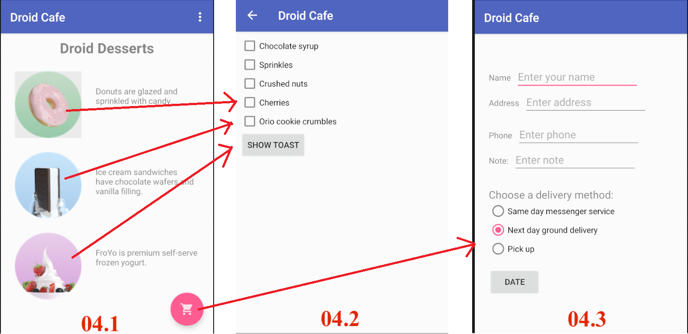
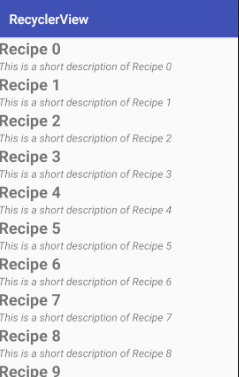

# AAD_HW04

This repository include **starter code**, **Espresso AndroidTest** and **Travis setting**, which are used for automatically grading in **Android Application Development course in National Cheng Kung University (NCKU)** in 2019 Spring Semester.

Materials:
- **Lesson 4: User interaction** in Codelabs for Android Developer Fundamentals (V2). 
<https://developer.android.com/courses/fundamentals-training/toc-v2>

Feel free to fork this repository if you are also working on this codelab and want to testing your answer.
For more instructions, please follow the [homework rules slides](https://github.com/ncku-csie/AAD_HW01/blob/master/Homework%20Rules.pdf). 
If you have further questions, please contact android@imslab.org

These test cases are written by Intelligent Mobile Service laboratory and Cyber Physical System Laboratory in NCKU.

---

Please follow the instructions on the **Homework** sections in these codelabs.

- [04.1: Clickable images](https://codelabs.developers.google.com/codelabs/android-training-clickable-images/index.html?index=..%2F..%2Fandroid-training#9)
- [04.2: Input controls](https://codelabs.developers.google.com/codelabs/android-training-input-controls/index.html?index=..%2F..%2Fandroid-training#10)
- [04.3: Menus and pickers](https://codelabs.developers.google.com/codelabs/android-training-menus-and-pickers/index.html?index=..%2F..%2Fandroid-training#12)
- [04.4: User navigation](https://codelabs.developers.google.com/codelabs/android-training-provide-user-navigation/index.html?index=..%2F..%2Fandroid-training#8)
- [04.5: RecyclerView](https://codelabs.developers.google.com/codelabs/android-training-create-recycler-view/index.html?index=..%2F..%2Fandroid-training#10)

## Part 1. Questions (20 pt)
Please submit your answer on moodle.
<https://moodle.ncku.edu.tw/course/view.php?id=104771>

**[Notice]** 
- You only have **one chance** to submit your answer.
- Your score on moodle (out of 100) * 20 % = your points in this part.  
For example, you score on moodle is 50, and then you got 50 * 20 % = 10 pt for this homework

| Codelab | Questions |
| --- | ----------- |
| 04.1 | 3 Questions |
| 04.2 | 3 Questions |
| 04.3 | 4 Questions |
| 04.4 | 3 Questions |
| 04.5 | 3 Questions |

## Part 2. Android Tests (80 pt)

Please submit your code to the **master** branch in this repository for grading.

**[Notice]** 
- Please do not modify the following files:
    - .travis.yml
    - <Project>/app/src/androidTest/*
    - gradle files
- Once any modifications or any cheating behavior are detected, you will got 0 pt for this homework.
- Creating a new branch to develop and testing locally are highly recommended.
    
<table>
    <thead>
        <tr>
            <th>Codelab</th>
            <th>Starter Code</th>
            <th>Test file Name</th>
            <th>Questions</th>
            <th>Points</th>
        </tr>
    </thead>
    <tbody>
        <tr>
            <td>04.1</td>
            <td>DroidCafe - MainActivity</td>
            <td>MainActivityTest</td>
            <td>testHorizontalLayout</td>
            <td>10 pt</td>
        </tr>
        <tr>
            <td rowspan=2>04.2</td>
            <td rowspan=2>DroidCafe - CheckboxesActivity</td>
            <td rowspan=2>CheckboxesActivityTest</td>
            <td>testCheckboxesLayout</td>
            <td>10 pt</td>
        </tr>
        <tr>
            <td>testOnSubmitToast</td>
            <td>10 pt</td>
        </tr>
        <tr>
            <td rowspan=2>04.3</td>
            <td rowspan=2>DroidCafe - OrderActivity</td>
            <td rowspan=2>OrderActivityTest</td>
            <td>testDateButton</td>
            <td>10 pt</td>
        </tr>
        <tr>
            <td>testDatePickerToast</td>
            <td>10 pt</td>
        </tr>
        <tr>
            <td rowspan=2>04.5</td>
            <td rowspan=2>RecyclerView</td>
            <td rowspan=2>RecyclerViewTest</td>
            <td>testRecyclerViewLayout</td>
            <td>15 pt</td>
        </tr>
        <tr>
            <td>testRecyclerViewOnClick</td>
            <td>15 pt</td>
        </tr>
    </tbody>
</table>

## workflow of DroidCafe (04.1-04.3)

## Data Example for RecyclerView (04.5)

Note: index starts from 0.

----
## Optional Homework

Following quesetions are optional. 
**Please do not upload any results of these questions.**

| Codelab | Notes |
| --- | --- |
| 04.4 | Since the homework in this section is duplicated in other sections, students can practice by yourselves. |

----
